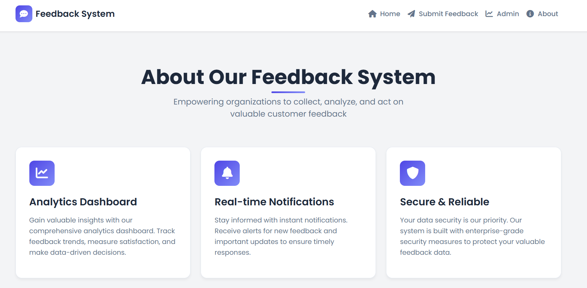
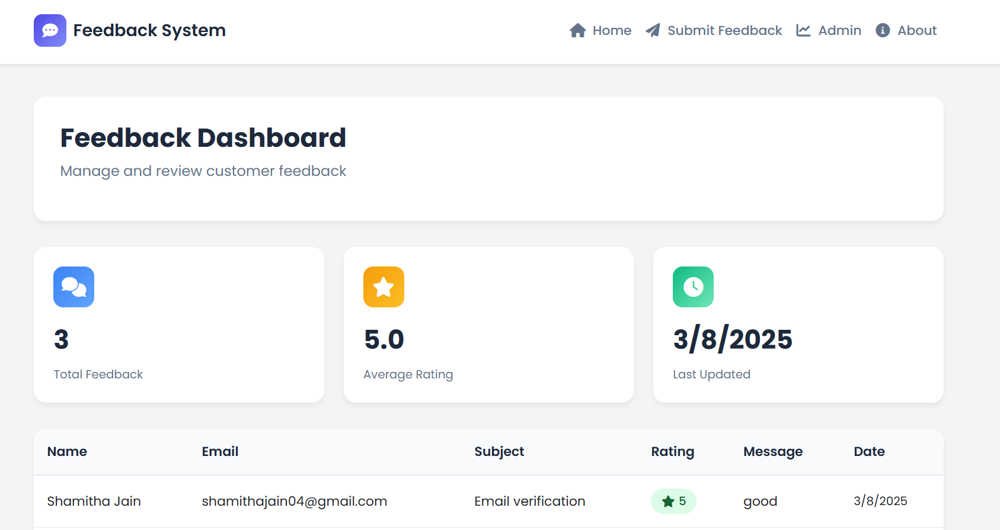
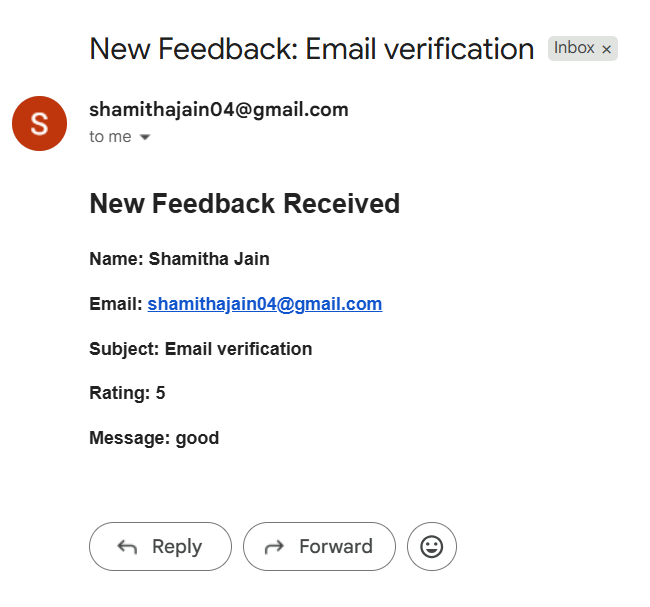

# Feedback App

A full-stack customer feedback management system that helps you collect, analyze, and act on user insights.

## 🚀 Features

- Submit feedback with form validation
- Admin dashboard to view feedback
- Email notifications for responses
- MongoDB for storing feedback
- Responsive UI with EJS templates

## 🛠️ Tech Stack

- **Frontend:** HTML, CSS, JavaScript, EJS
- **Backend:** Node.js, Express
- **Database:** MongoDB
- **Mail Service:** Nodemailer

## 📦 Installation

```bash
git clone https://github.com/ShamithaJain/Feedback-app.git
cd Feedback-app
npm install

## 📸 Screenshots

### 🏠 Home Page


### 📖 About Page


### 📊 Admin Dashboard


### 📬 Feedback Notification Email

